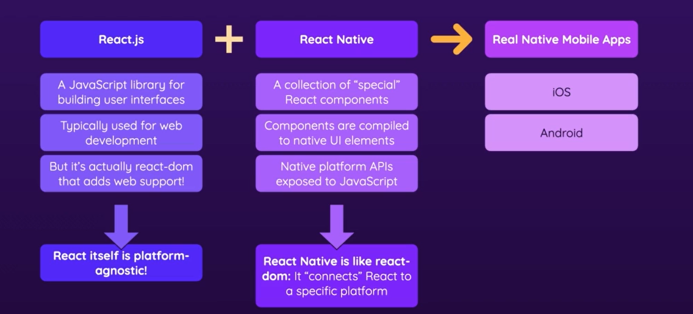

# React Native

### [Website](https://reactnative.dev/)

#### [Expo Doc](https://docs.expo.dev/)



#### Project Setup (Using EXPO):

```bash
npx create-expo-app AwesomeProject

cd AwesomeProject
npx expo start
```

- In order to preview the app you need to install the Expo Go app on your phone.
    - Then scan the qr code generated in the cli with your camera in order to view the app.


