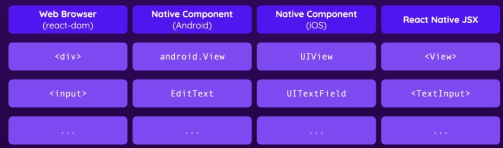

# React Native

### [Website](https://reactnative.dev/)

#### [Expo Doc](https://docs.expo.dev/)


#### Project Setup (Using EXPO):

```bash
npx create-expo-app AwesomeProject

cd AwesomeProject
npx expo start
```

- In order to preview the app you need to install the Expo Go app on your phone.
    - Then scan the qr code generated in the cli with your camera in order to view the app.

---
---

## Basics of React Native:

- In normal React we have the DOM in the browser which supports html elements like a `<div/>` ... The native components for android and IOS do not support html elements...



#### [Core Components](https://reactnative.dev/docs/components-and-apis)


- There also are not any css files... you can style components with inline styles or stylesheet objets.
- This is written in Javascript and mimics css syntax but only suports a subset of the properties and features of css.


- In normal react for html, text between elements is ok... i.e. `<div>This is some text </div>`, however, this will not work in React Native... text must go inside of a `<Text>Hello World!!!!</Text>` element. 


- The `<View>` component is a container component... similar to a div.


The most fundamental component for building a UI,A`View`Ais a container that supports layout withA[flexbox](https://reactnative.dev/docs/flexbox),A[style](https://reactnative.dev/docs/style),A[some touch handling](https://reactnative.dev/docs/handling-touches), andA[accessibility](https://reactnative.dev/docs/accessibility)Acontrols.A`View`Amaps directly to the native view equivalent on whatever platform React Native is running on, whether that is aA`UIView`,A`<div>`,A`android.view`, etc.

`View`Ais designed to be nested inside other views and can have 0 to many children of any type.


- When using html elements in react you don't need to import anything... in react native you need to import all of the components...i.e.

```js
import { StyleSheet, Text, View, Button } from "react-native";
export default function App() {
  return (
    <View style={styles.container}>
      <View>
        <Text>Another piece of text</Text>
      </View>
      <Text>Hello World!!!!</Text>
      <Button></Button>
    </View>
  );
}
```

- In react native you don't put the text for a button between button tags... instead you write it like this:

```js
      <Button title='Press me!!'/>
```


- To style prop is not supported on all React Native elements but it is supported on the view element.
